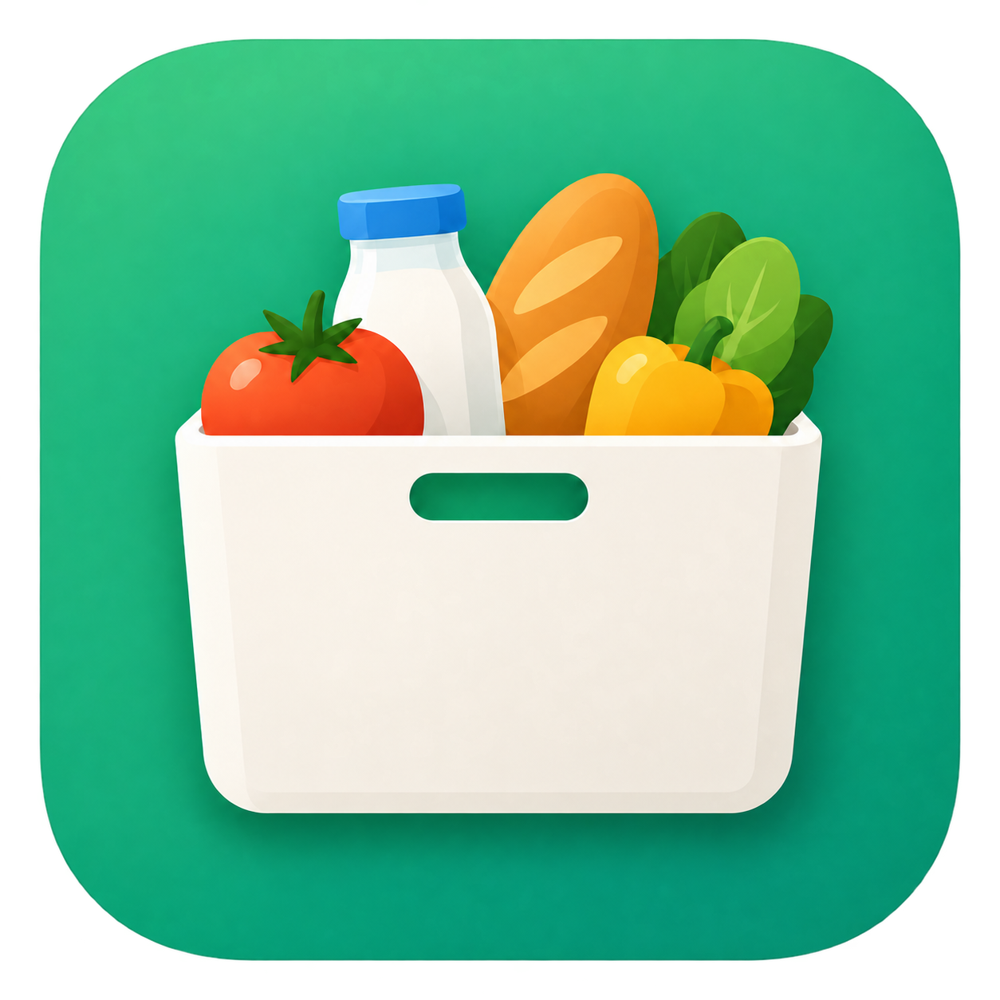
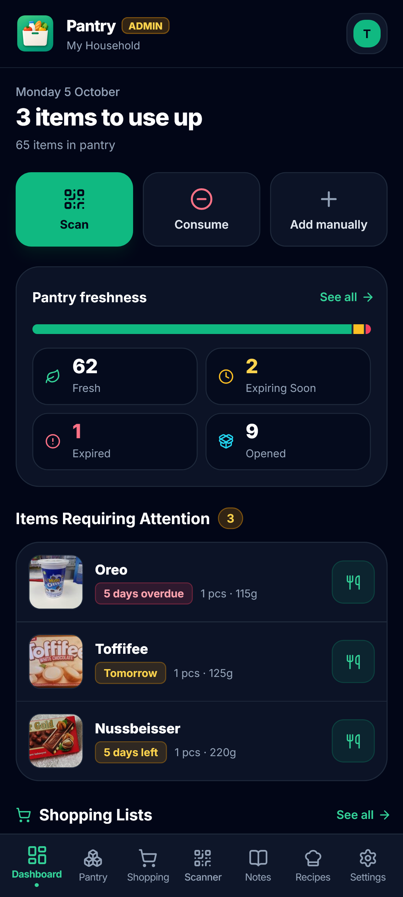
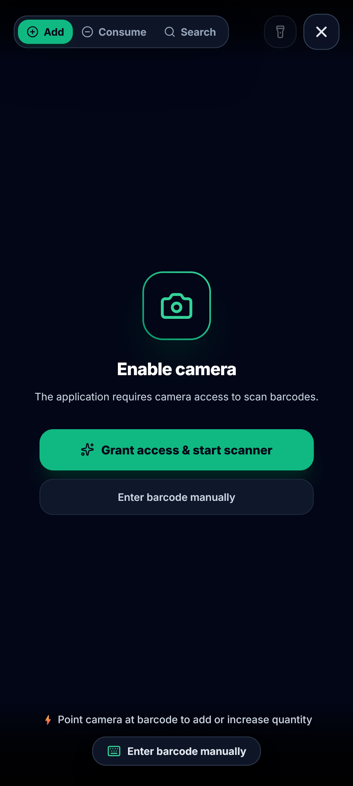
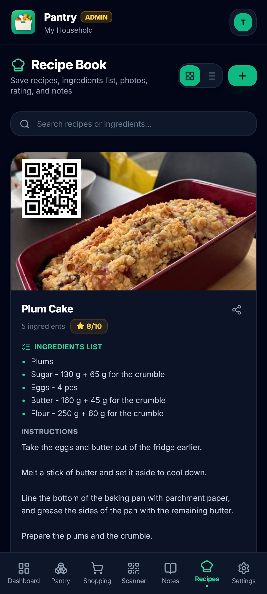
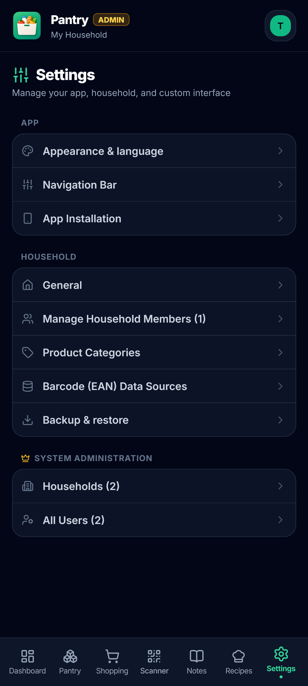

#  Pantry

[🇵🇱 Wersja polska](README-PL.md) | [🇬🇧 English Version](README.md) | [🌐 Website & more screenshots](https://paczuu.pl/pantry)

A self-hosted, full-stack **Progressive Web App (PWA)** for household pantry management and kitchen inventory. Scan EAN barcodes, track product expiry dates, share real-time shopping lists, and store notes and recipes in one place.

Built specifically for home servers and private self-hosted environments where you maintain full control over accounts, households, and data privacy.

<details>
<summary>Extra</summary>

This project was created for personal use with heavy assistance from Artificial Intelligence (AI). The application is under active development and **requires further testing** in real-world scenarios.

If you encounter any bugs, have ideas for new features, or want to improve the codebase – **any feedback, issue reports, and Pull Requests are deeply appreciated!**

</details>

## Showcase

| Dashboard | Scanner | Recipes | Settings |
| :---: | :---: | :---: | :---: |
|  |  |  |  |

📸 **More screenshots available at:** [paczuu.pl/pantry](https://paczuu.pl/pantry)

## Features

### 📦 Pantry & Barcode Scanner
- **Camera Barcode Scanner:** Scan EAN barcodes with device cameras using `html5-qrcode` (supports front/rear selection, flashlight toggle, and audio feedback).
- **Manual Entry & Custom Products:** Easily handle products without barcodes.
- **Scan & Add Mode:** Scan EAN → auto-fetch product data → pick an expiry shortcut (`+3 days`, `+1 week`, `+1 month`, or custom calendar date) → save to pantry.
- **Quick Remove Mode:** Rapid scanning mode to match pantry items and subtract quantities (`1`, `2`, `5`, or `all`) as consumed or wasted.
- **Scanner Search:** Instantly look up items in your current pantry by scanning.

### 🔍 Product Lookup & Catalog
- **Open Food Facts Integration:** Automatic metadata retrieval (food items, beauty products, pet food, and general goods).
- **Customizable Sources:** Per-household configuration for barcode source priorities, country code filters, and API toggles.

### 🛒 Shopping Lists, Notes & Recipes
- **Shared Shopping Lists:** Multiple lists with real-time sync across household members.
- **Smart Auto-Add:** Move expired or nearing-expiry items onto shopping lists.
- **Pinned Notes & Checklists:** Color-tagged notes with pinning and quick task lists.
- **Recipe Manager:** Save favorite recipes with ingredient checklists, photos, ratings, and instructions.

### 👥 Households, Roles & Security
- **Authentication:** JWT-based login with hashed passwords via `bcrypt`.
- **First Install:** The first registered account automatically becomes the household `ADMIN` and **System Admin** (instance owner).
- **Invite Code System:** Prevent unauthorized registration. New users join only via a 6-character, 5-minute time-limited invite code generated by a household admin.
- **Household Management:** Rename household, generate invite codes, assign member roles, and manage members.
- **System Admin Panel:** Instance-wide overview to manage all users and households, grant/revoke system admin status, and purge accounts.
- **Audit Logging:** Detailed history tracking changes (adds, edits, quantity drops, disposals, transfers) with user attribution.

### 📱 PWA & Realtime Experience
- **Installable PWA:** Native-like experience on iOS and Android.
- **Realtime Updates:** Instant UI updates across all connected devices in the household.
- **Personalization:** Configurable accent colors, bottom navidation, customizable expiry warning, custom categories, and database backup/restore tools.

## Tech Stack

| Layer | Technologies |
| --- | --- |
| **Frontend** | React 18, TypeScript, Vite, Tailwind CSS, Lucide Icons, `html5-qrcode`, Socket.IO Client, `vite-plugin-pwa` |
| **Backend** | Node.js, Express, TypeScript, Prisma ORM, SQLite, JWT, `bcrypt`, Zod, Socket.IO, Axios |
| **Product Data** | Open Food Facts, Open Beauty Facts, Open Products Facts, Open Pet Food Facts, own data |
| **Deployment** | Docker Compose, Nginx (Frontend & Reverse Proxy), SQLite Volume (`./data`) |

## Prerequisites

- **Docker & Docker Compose** (Recommended for hosting), or
- **Node.js 18+** with **npm** for local development.

## Environment Variables

### Backend (`/backend/.env`)

| Variable | Default | Description |
| --- | --- | --- |
| `PORT` | `3001` | HTTP port for the Express backend server |
| `DATABASE_URL` | `file:./data/pantry.db` | SQLite database connection string |
| `JWT_SECRET` | *Required* | Secret key used for signing JWT authentication tokens |
| `NODE_ENV` | `development` | Application environment (`development` / `production`) |

## Deployment & Installation

### Option A: Standard Docker Compose (Recommended)

Run the container stack directly from the repository root:

```bash
docker compose up -d --build
```

* **Application URL:** `http://localhost:3200`
* **Database Location:** `./data/pantry.db` (persisted on host volume)

To stop the stack:

```bash
docker compose down
```

### Option B: Local Development (Node.js)

#### 1. Backend Setup

```bash
cd backend
cp .env.example .env
```

Configure your `.env` file, then run:

```bash
npm install
npm run prisma:generate
npm run prisma:push
npm run dev
```

The backend server runs at `http://localhost:3001`.

#### 2. Frontend Setup

In a separate terminal window:

```bash
cd frontend
npm install
npm run dev
```

The frontend development server runs at `http://localhost:5173`. Vite is configured to proxy `/api` and Socket.IO requests to port `3001`.

#### 3. Root Utility Scripts

From the repository root (`package.json`):

```bash
npm run build          # Builds frontend then backend
npm run build:frontend
npm run build:backend
npm start              # Runs compiled production backend
```

### Option C: Portainer / Home Lab NAS Installation - COMING SOON!

## Database Management & Prisma Studio

If you need to inspect or modify the database visually via browser GUI:

```bash
cd backend
npx prisma studio
```

Prisma Studio will open at `http://localhost:5555`.

> **Note on passwords:** Passwords in SQLite are hashed via `bcrypt`. When changing passwords manually in Prisma Studio, paste a valid `$2b$10$...` bcrypt hash rather than plain text.

## First Login & Onboarding

1. Open the app and **Register** the first user account (with an empty database). This user automatically becomes household `ADMIN` and **System Admin**.
2. Navigate to **Settings** → **General** to generate a 6-digit invite code (valid for 5 minutes).
3. Share the invite code with family members so they can register and join your household. Other users cannot create standalone households.
4. Additional households can be created through the System Admin panel in Settings.

## Backups & Security Notes
 
* **In-App Backup & Restore:** An admin can create a backup directly from **Settings**, which downloads a `.json` file with your data. The same file can later be uploaded in Settings to restore the data.
* **Database Backup (manual):** All inventory data, accounts, notes, and logs are stored inside a single SQLite file (`./data/pantry.db`). Simply back up the `./data` folder regularly.
 
* **JWT Secret:** Always set a strong, unique `JWT_SECRET`. Changing this secret will invalidate active user sessions, requiring everyone to re-login.
* **HTTPS Requirement:** Always serve the app over **HTTPS** (e.g. via Cloudflare Tunnels, Nginx Proxy Manager, or Caddy) when accessing remotely. Browsers restrict camera permissions (required for barcode scanning) and PWA installation on insecure `http://` connections.

## License

Distributed under the **MIT License**. See [LICENCE](LICENCE) for details.