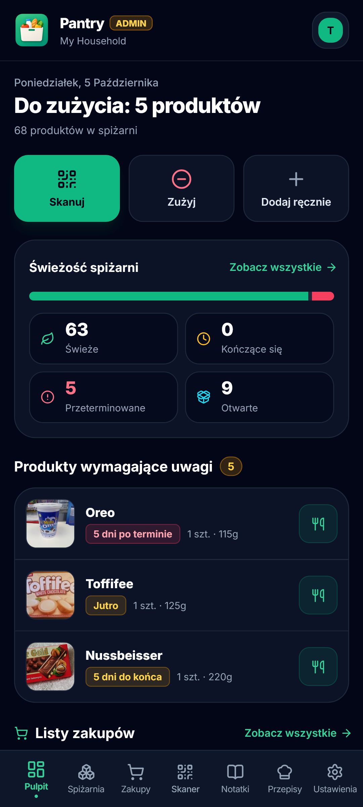
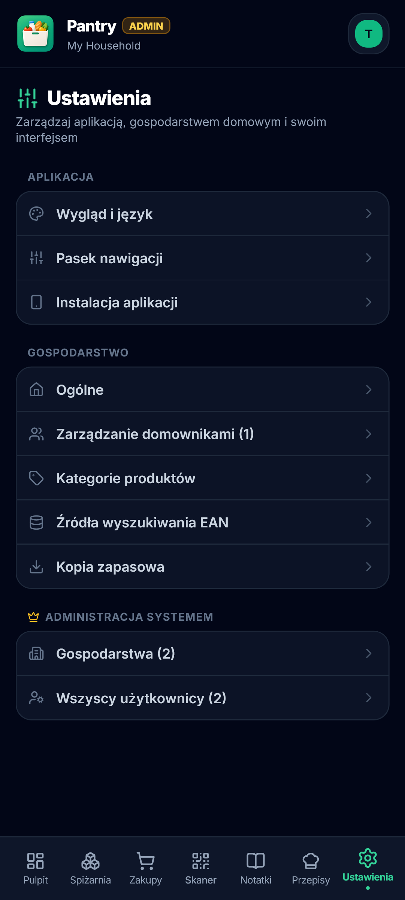

#  Pantry

> Ten projekt został stworzony na potrzeby własne przy dużym wsparciu sztucznej inteligencji (AI). Aplikacja jest aktywnie rozwijana i **wymaga dalszych testów** w rzeczywistych warunkach.
>
> Jeśli znajdziesz błąd, masz pomysł na nową funkcję lub chcesz ulepszyć kod – **wszelkie opinie, zgłoszenia błędów oraz Pull Requesty są bardzo mile widziane!**

[🇵🇱 Wersja polska](README.pl.md) | [🇬🇧 English Version](README.md)

Samodzielnie hostowana **aplikacja Progressive Web App (PWA)** do zarządzania domową spiżarnią i zapasami kuchennymi. Skanuj kody kreskowe EAN, kontroluj daty ważności produktów, współdziel listy zakupów w czasie rzeczywistym oraz przechowuj notatki i przepisy w jednym miejscu.

Projekt został stworzony z myślą o domowych serwerach i prywatnych środowiskach self-hosted, w których użytkownik zachowuje pełną kontrolę nad kontami, gospodarstwami domowymi i prywatnością danych.

## Prezentacja

| Pulpit | Skaner | Przepisy | Ustawienia |
| :---: | :---: | :---: | :---: |
|  |  |  |  |

## Funkcje

### 📦 Spiżarnia i skaner kodów kreskowych

- **Skaner kodów kreskowych:** Skanuj kody EAN przy użyciu aparatu urządzenia dzięki `html5-qrcode` (obsługa wyboru przedniej/tylnej kamery, latarki oraz sygnału dźwiękowego).
- **Ręczne dodawanie i produkty niestandardowe:** Łatwe dodawanie produktów, które nie posiadają kodów kreskowych.
- **Tryb „Skanuj i dodaj”:** Zeskanuj EAN → automatycznie pobierz dane produktu → wybierz termin ważności (`+3 dni`, `+1 tydzień`, `+1 miesiąc` lub własną datę z kalendarza) → zapisz produkt w spiżarni.
- **Tryb szybkiego usuwania:** Szybkie skanowanie produktów znajdujących się w spiżarni i zmniejszanie ich ilości (`1`, `2`, `5` lub `wszystkie`) po ich zużyciu lub wyrzuceniu.
- **Wyszukiwanie za pomocą skanera:** Natychmiast wyszukuj produkty znajdujące się w aktualnej spiżarni poprzez zeskanowanie ich kodu.

### 🔍 Wyszukiwanie produktów i katalog

- **Integracja z Open Food Facts:** Automatyczne pobieranie informacji o produktach spożywczych, kosmetykach, karmie dla zwierząt oraz produktach ogólnego użytku.
- **Konfigurowalne źródła danych:** Możliwość konfiguracji dla każdego gospodarstwa domowego kolejności priorytetów źródeł danych kodów kreskowych, filtrów kodów krajów oraz włączania/wyłączania poszczególnych API.

### 🛒 Listy zakupów, notatki i przepisy

- **Współdzielone listy zakupów:** Wiele list z synchronizacją w czasie rzeczywistym pomiędzy członkami gospodarstwa domowego.
- **Inteligentne automatyczne dodawanie:** Automatyczne przenoszenie produktów przeterminowanych lub zbliżających się do terminu ważności na listy zakupów.
- **Przypięte notatki i checklisty:** Kolorowe notatki z możliwością przypinania oraz szybkie listy zadań.
- **Menedżer przepisów:** Zapisywanie ulubionych przepisów wraz z listami składników, zdjęciami, ocenami i instrukcjami przygotowania.

### 👥 Gospodarstwa domowe, role i bezpieczeństwo

- **Uwierzytelnianie:** Logowanie oparte na JWT z hasłami przechowywanymi w postaci bezpiecznych hashy przy użyciu `bcrypt`.
- **Pierwsza instalacja:** Pierwsze zarejestrowane konto automatycznie otrzymuje rolę `ADMIN` w gospodarstwie domowym oraz uprawnienia **Administratora Systemu** (właściciela instancji).
- **System kodów zaproszeń:** Zapobieganie nieautoryzowanym rejestracjom. Nowi użytkownicy mogą dołączyć wyłącznie za pomocą 6-znakowego kodu zaproszenia, ważnego przez 5 minut i wygenerowanego przez administratora gospodarstwa domowego.
- **Zarządzanie gospodarstwem domowym:** Zmiana nazwy gospodarstwa, generowanie kodów zaproszeń, przypisywanie ról oraz zarządzanie członkami.
- **Panel Administratora Systemu:** Przegląd całej instancji umożliwiający zarządzanie wszystkimi użytkownikami i gospodarstwami domowymi, nadawanie/odbieranie uprawnień administratora systemu oraz usuwanie kont.
- **Dziennik audytowy:** Szczegółowa historia zmian obejmująca dodawanie, edycję, zmiany ilości, wyrzucanie oraz przenoszenie produktów, wraz z informacją o użytkowniku wykonującym daną operację.

### 📱 PWA i obsługa czasu rzeczywistego

- **Instalowalna aplikacja PWA:** Interfejs przypominający natywną aplikację, dostępny na urządzeniach z iOS i Androidem.
- **Aktualizacje w czasie rzeczywistym:** Natychmiastowe aktualizowanie interfejsu na wszystkich połączonych urządzeniach członków gospodarstwa domowego.
- **Personalizacja:** Konfigurowalne kolory akcentów, dolna nawigacja, ustawienia ostrzeżeń o zbliżającym się terminie ważności, własne kategorie oraz narzędzia do tworzenia i przywracania kopii zapasowych bazy danych.

## Stos technologiczny

| Warstwa | Technologie |
| --- | --- |
| **Frontend** | React 18, TypeScript, Vite, Tailwind CSS, Lucide Icons, `html5-qrcode`, Socket.IO Client, `vite-plugin-pwa` |
| **Backend** | Node.js, Express, TypeScript, Prisma ORM, SQLite, JWT, `bcrypt`, Zod, Socket.IO, Axios |
| **Dane produktów** | Open Food Facts, Open Beauty Facts, Open Products Facts, Open Pet Food Facts, własne dane |
| **Wdrożenie** | Docker Compose, Nginx (Frontend i Reverse Proxy), wolumen SQLite (`./data`) |

## Wymagania

- **Docker i Docker Compose** (zalecane w przypadku hostowania aplikacji), lub
- **Node.js 18+** wraz z **npm** do lokalnego środowiska deweloperskiego.

## Zmienne środowiskowe

### Backend (`/backend/.env`)

| Zmienna | Domyślna wartość | Opis |
| --- | --- | --- |
| `PORT` | `3001` | Port HTTP serwera backendu Express |
| `DATABASE_URL` | `file:./data/pantry.db` | Connection string bazy danych SQLite |
| `JWT_SECRET` | *\*Wymagane\** | Tajny klucz używany do podpisywania tokenów uwierzytelniających JWT |
| `NODE_ENV` | `development` | Środowisko aplikacji (`development` / `production`) |

## Wdrożenie i instalacja

### Opcja A: Standardowy Docker Compose (zalecane)

Uruchom stos kontenerów bezpośrednio z katalogu głównego repozytorium:

```bash
docker compose up -d --build
```

- **Adres aplikacji:** `http://localhost:3200`
- **Lokalizacja bazy danych:** `./data/pantry.db` (dane są przechowywane na trwałym wolumenie hosta)

Aby zatrzymać stos kontenerów:

```bash
docker compose down
```

### Opcja B: Lokalne środowisko deweloperskie (Node.js)

#### 1. Konfiguracja backendu

```bash
cd backend
cp .env.example .env
```

Skonfiguruj plik `.env`, a następnie uruchom:

```bash
npm install
npm run prisma:generate
npm run prisma:push
npm run dev
```

Serwer backendu będzie dostępny pod adresem `http://localhost:3001`.

#### 2. Konfiguracja frontendu

W osobnym oknie terminala:

```bash
cd frontend
npm install
npm run dev
```

Serwer deweloperski frontendu będzie dostępny pod adresem `http://localhost:5173`. Vite jest skonfigurowany tak, aby przekierowywać żądania `/api` oraz Socket.IO do portu `3001`.

#### 3. Skrypty pomocnicze z katalogu głównego

Z poziomu katalogu głównego repozytorium (`package.json`):

```bash
npm run build          # Buduje frontend, a następnie backend
npm run build:frontend
npm run build:backend
npm start              # Uruchamia skompilowany backend produkcyjny
```

### Opcja C: Instalacja przez Portainer / Home Lab NAS — WKRÓTCE!

## Zarządzanie bazą danych i Prisma Studio

Jeśli potrzebujesz przeglądać lub modyfikować bazę danych za pomocą graficznego interfejsu dostępnego w przeglądarce:

```bash
cd backend
npx prisma studio
```

Prisma Studio zostanie uruchomione pod adresem `http://localhost:5555`.

> **Uwaga dotycząca haseł:**
> Hasła w SQLite są przechowywane w postaci hashy przy użyciu `bcrypt`. Podczas ręcznej zmiany haseł w Prisma Studio należy wkleić poprawny hash bcrypt w formacie `$2b$10$...`, a nie hasło w postaci jawnego tekstu.

## Pierwsze logowanie i konfiguracja

1. Otwórz aplikację i **zarejestruj** pierwsze konto użytkownika (przy pustej bazie danych). Użytkownik ten automatycznie otrzyma rolę `ADMIN` w gospodarstwie domowym oraz uprawnienia **Administratora Systemu**.
2. Przejdź do **Ustawienia** → **Ogólne**, aby wygenerować 6-znakowy kod zaproszenia (ważny przez 5 minut).
3. Udostępnij kod zaproszenia członkom rodziny, aby mogli się zarejestrować i dołączyć do Twojego gospodarstwa domowego. Pozostali użytkownicy nie mogą tworzyć samodzielnych gospodarstw domowych.
4. Dodatkowe gospodarstwa domowe można tworzyć za pomocą Panelu Administratora Systemu w Ustawieniach.

## Kopie zapasowe i uwagi dotyczące bezpieczeństwa

- **Kopia zapasowa i przywracanie w aplikacji:** Administrator może utworzyć kopię zapasową bezpośrednio z poziomu **Ustawień**. Kopia zostanie pobrana jako plik `.json`. Ten sam plik można później przesłać w Ustawieniach, aby przywrócić dane.
- **Ręczna kopia bazy danych:** Wszystkie dane dotyczące zapasów, kont, notatek i logów są przechowywane w jednym pliku SQLite (`./data/pantry.db`). Zaleca się regularne wykonywanie kopii zapasowej całego katalogu `./data`.
- **JWT Secret:** Zawsze ustawiaj silny i unikalny `JWT_SECRET`. Zmiana tego sekretu spowoduje unieważnienie aktywnych sesji użytkowników i konieczność ponownego zalogowania się wszystkich użytkowników.
- **Wymóg HTTPS:** Zawsze udostępniaj aplikację przez **HTTPS** (np. za pomocą Cloudflare Tunnels, Nginx Proxy Manager lub Caddy), jeśli korzystasz z niej zdalnie. Przeglądarki ograniczają dostęp do aparatu na niezabezpieczonych połączeniach `http://`, a aparat jest wymagany do skanowania kodów kreskowych. HTTPS jest również wymagane do poprawnej instalacji PWA.

## Licencja

Projekt jest rozpowszechniany na warunkach **licencji MIT**. Szczegóły znajdują się w pliku [LICENCE](LICENCE).